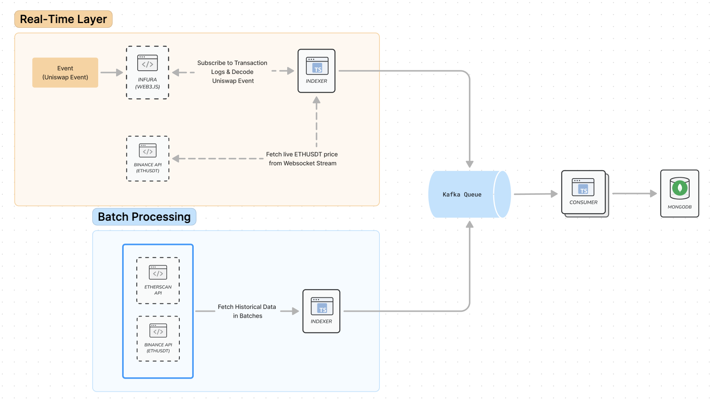

# Ethereum Indexer

## Table of Contents
1. [Overview](#overview)
2. [Environment Variables](#setup-environment-variables)
3. [Running the Application](#running-the-application)
   - [Using Docker](#using-docker)
   - [Testing REST API Interface via Swagger UI](#testing-rest-api-interface-via-swagger-ui)
4. [Architectural Considerations](#architectural-considerations)

## Overview
The backend system is built to keep track of all the transactions involved in the Uniswap V3 USDC/ETH pool. The system supports both real-time and historical batch data processing via Etherscan API, Web3.js, and Binance API (for ETH/USDT price)

> [!NOTE]
> For more information on the architectural considerations, please refer to [here](#architectural-considerations)

## Setup Environment Variables
Make sure to create a .env file in the root directory of the project with the following variables:
```
MONGO_URI=
MONGO_INITDB_ROOT_USERNAME=
MONGO_INITDB_ROOT_PASSWORD=

ETHERSCAN_API_KEY=
INFURA_MAINNET_WS=
TARGET_ADDRESS=
KAFKA_BROKERS=
```

## Running the Application

### Using Docker

1. Build and start the application along with its dependencies (MongoDB, Kafka, and Zookeeper), run:

```sh
docker-compose up --build -d
```

2. To check logs for each component
```sh
docker-compose logs -f node-app
docker-compose logs -f consumer-app
```

3. Run Test
```sh
docker compose run node-app npm run test -- BlockIndexerService.test.ts --forceExit
docker compose run node-app npm run test -- EthPriceService.test.ts 
```

### Testing REST API Interface via Swagger UI

Once the application is running, you can navigate to Swagger UI to execute APIs by visiting:
```
http://localhost:3000/api-docs
```

## Architectural Considerations


**1. Event-Driven Architecture: Asynchronous Processing using Kafka**
   - Consideration: Event-driven architecture provides high decoupling between services, allowing the system to handle high transaction volumes efficiently with each component operating asynchronously. 

**2. Websocket Streams for Live Data**
   - Consideration: By using Infura for blockchain events and Binance API for price updates, the architecture can handle real-time data flow with minimal delays, crucial for time-sensitive data like transaction fees.

**3. MongoDB (Database):**
   - Consideration: The choice of MongoDB is driven by its flexibility in handling different data structures, which is useful for both transaction logs and historical data.

**4. Circuit Breaker Pattern & Rate Limiting**
   - Consideration: If the system detects a failure in the real-time price fetch or blockchain data fetch, the circuit breaker stops the requests temporarily to prevent the system from wasting resources on repeated failed attempts and allows it to recover more gracefully.
   - Additionally, a retry mechanism with backoff is implemented to gradually resume requests to the external services. This helps in reducing the load on the APIs while attempting to restore functionality.
